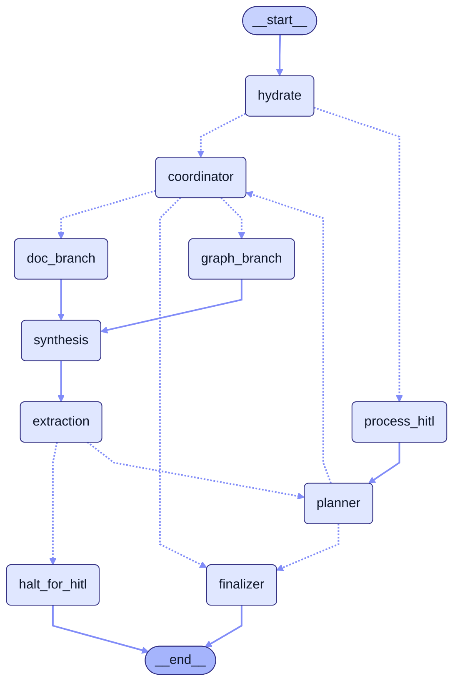

# LangGraph State Machine Diagram

```mermaid
---
config:
  flowchart:
    curve: linear
---
graph TD;
	__start__([__start__]):::first
	hydrate(hydrate)
	process_hitl(process_hitl)
	coordinator(coordinator)
	doc_branch(doc_branch)
	graph_branch(graph_branch)
	synthesis(synthesis)
	extraction(extraction)
	halt_for_hitl(halt_for_hitl)
	planner(planner)
	finalizer(finalizer)
	__end__([__end__]):::last
	__start__ --> hydrate;
	coordinator -.-> doc_branch;
	coordinator -.-> finalizer;
	coordinator -.-> graph_branch;
	doc_branch --> synthesis;
	extraction -.-> halt_for_hitl;
	extraction -.-> planner;
	graph_branch --> synthesis;
	hydrate -.-> coordinator;
	hydrate -.-> process_hitl;
	planner -.-> coordinator;
	planner -.-> finalizer;
	process_hitl --> planner;
	synthesis --> extraction;
	finalizer --> __end__;
	halt_for_hitl --> __end__;
	classDef default fill:#e0e7ff,line-height:1.2,color:#0f172a,stroke:#312e81,stroke-width:1px
	classDef first fill:#c7d2fe,color:#0f172a,stroke:#312e81,stroke-width:1px
	classDef last fill:#a5b4fc,color:#0f172a,stroke:#312e81,stroke-width:1px

	linkStyle default stroke:#818cf8,stroke-width:2px;
```
